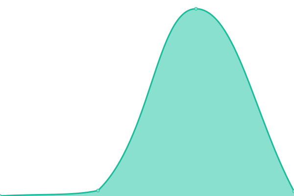

# [📈 Live Status](https://ccris02.github.io/uptime): <!--live status--> **🟩 All systems operational**

This repository contains the open-source uptime monitor and status page for [ccris02](https://polkaDIR.com), powered by [Upptime](https://github.com/upptime/upptime).

With [Upptime](https://upptime.js.org), you can get your own unlimited and free uptime monitor and status page, powered entirely by a GitHub repository. We use [Issues](https://github.com/ccris02/uptime/issues) as incident reports, [Actions](https://github.com/ccris02/uptime/actions) as uptime monitors, and [Pages](https://ccris02.github.io/uptime) for the status page.

<!--start: status pages-->
<!-- This summary is generated by Upptime (https://github.com/upptime/upptime) -->
<!-- Do not edit this manually, your changes will be overwritten -->
<!-- prettier-ignore -->
| URL | Status | History | Response Time | Uptime |
| --- | ------ | ------- | ------------- | ------ |
|  [ksm_1_candidate](https://kusama.w3f.community/candidate/Dq97kmsJXGTciU1eMXZMAp4D41Y9e7kQ4hmFBfZW7YD4CCf) | 🟩 Up | [ksm-1-candidate.yml](https://github.com/ccris02/upptime-1/commits/HEAD/history/ksm-1-candidate.yml) | 

 1370ms
     
 | 

<a href="https://ccris02.github.io/upptime-1/history/ksm-1-candidate">100.00%</a>
    

|  [ksm_1_erapoint](https://kusama.w3f.community/erapoints/Dq97kmsJXGTciU1eMXZMAp4D41Y9e7kQ4hmFBfZW7YD4CCf) | 🟩 Up | [ksm-1-erapoint.yml](https://github.com/ccris02/upptime-1/commits/HEAD/history/ksm-1-erapoint.yml) | 

 880ms
     
 | 

<a href="https://ccris02.github.io/upptime-1/history/ksm-1-erapoint">100.00%</a>
    

|  [ksm_1_score](https://kusama.w3f.community/score/Dq97kmsJXGTciU1eMXZMAp4D41Y9e7kQ4hmFBfZW7YD4CCf) | 🟩 Up | [ksm-1-score.yml](https://github.com/ccris02/upptime-1/commits/HEAD/history/ksm-1-score.yml) | 

 141ms
     
 | 

<a href="https://ccris02.github.io/upptime-1/history/ksm-1-score">100.00%</a>
    

|  [ksm_candidates](https://kusama.w3f.community/candidates) | 🟩 Up | [ksm-candidates.yml](https://github.com/ccris02/upptime-1/commits/HEAD/history/ksm-candidates.yml) | 

 2706ms
     
 | 

<a href="https://ccris02.github.io/upptime-1/history/ksm-candidates">100.00%</a>
    

|  [ksm_erastat](https://kusama.w3f.community/erastats) | 🟩 Up | [ksm-erastat.yml](https://github.com/ccris02/upptime-1/commits/HEAD/history/ksm-erastat.yml) | 

 145ms
     
 | 

<a href="https://ccris02.github.io/upptime-1/history/ksm-erastat">100.00%</a>
    

|  [ksm_location](https://kusama.w3f.community/locationstats) | 🟩 Up | [ksm-location.yml](https://github.com/ccris02/upptime-1/commits/HEAD/history/ksm-location.yml) | 

 161ms
     
 | 

<a href="https://ccris02.github.io/upptime-1/history/ksm-location">100.00%</a>
    

|  [dot_1_candidate](https://polkadot.w3f.community/candidate/149riLdwAVzXg7Cm88RcXhbuFi3zUgwrGsJSSPjC47PRxHQW) | 🟩 Up | [dot-1-candidate.yml](https://github.com/ccris02/upptime-1/commits/HEAD/history/dot-1-candidate.yml) | 

 448ms
     
 | 

<a href="https://ccris02.github.io/upptime-1/history/dot-1-candidate">100.00%</a>
    

|  [dot_1_erapoint](https://polkadot.w3f.community/erapoints/149riLdwAVzXg7Cm88RcXhbuFi3zUgwrGsJSSPjC47PRxHQW) | 🟩 Up | [dot-1-erapoint.yml](https://github.com/ccris02/upptime-1/commits/HEAD/history/dot-1-erapoint.yml) | 

 241ms
     
 | 

<a href="https://ccris02.github.io/upptime-1/history/dot-1-erapoint">100.00%</a>
    

|  [dot_1_score](https://polkadot.w3f.community/score/149riLdwAVzXg7Cm88RcXhbuFi3zUgwrGsJSSPjC47PRxHQW) | 🟩 Up | [dot-1-score.yml](https://github.com/ccris02/upptime-1/commits/HEAD/history/dot-1-score.yml) | 

 133ms
     
 | 

<a href="https://ccris02.github.io/upptime-1/history/dot-1-score">100.00%</a>
    

|  [dot_candidate](https://polkadot.w3f.community/candidates) | 🟩 Up | [dot-candidate.yml](https://github.com/ccris02/upptime-1/commits/HEAD/history/dot-candidate.yml) | 

 1625ms
     
 | 

<a href="https://ccris02.github.io/upptime-1/history/dot-candidate">100.00%</a>
    

|  [dot_erastat](https://polkadot.w3f.community/erastats) | 🟩 Up | [dot-erastat.yml](https://github.com/ccris02/upptime-1/commits/HEAD/history/dot-erastat.yml) | 

 137ms
     
 | 

<a href="https://ccris02.github.io/upptime-1/history/dot-erastat">100.00%</a>
    

|  [dot_location](https://polkadot.w3f.community/locationstats) | 🟩 Up | [dot-location.yml](https://github.com/ccris02/upptime-1/commits/HEAD/history/dot-location.yml) | 

 173ms
     
 | 

<a href="https://ccris02.github.io/upptime-1/history/dot-location">100.00%</a>
    

|  [google.com](https://google.com) | 🟩 Up | [google-com.yml](https://github.com/ccris02/upptime-1/commits/HEAD/history/google-com.yml) | 

 316ms
     
 | 

<a href="https://ccris02.github.io/upptime-1/history/google-com">100.00%</a>
    

<!--end: status pages-->

[**Visit our status website →**](https://ccris02.github.io/uptime)

## 📄 License

- Powered by: [Upptime](https://github.com/upptime/upptime)
- Code: [MIT](./LICENSE) © [ccris02](https://polkaDIR.com)
- Data in the `./history` directory: [Open Database License](https://opendatacommons.org/licenses/odbl/1-0/)
